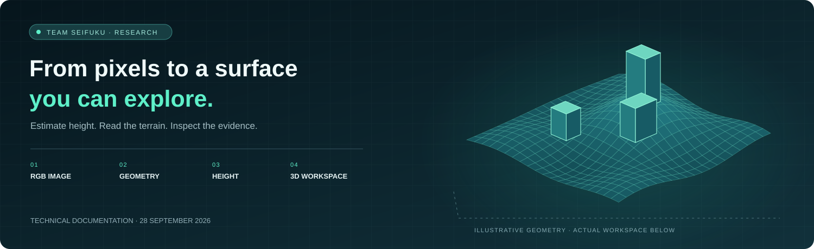
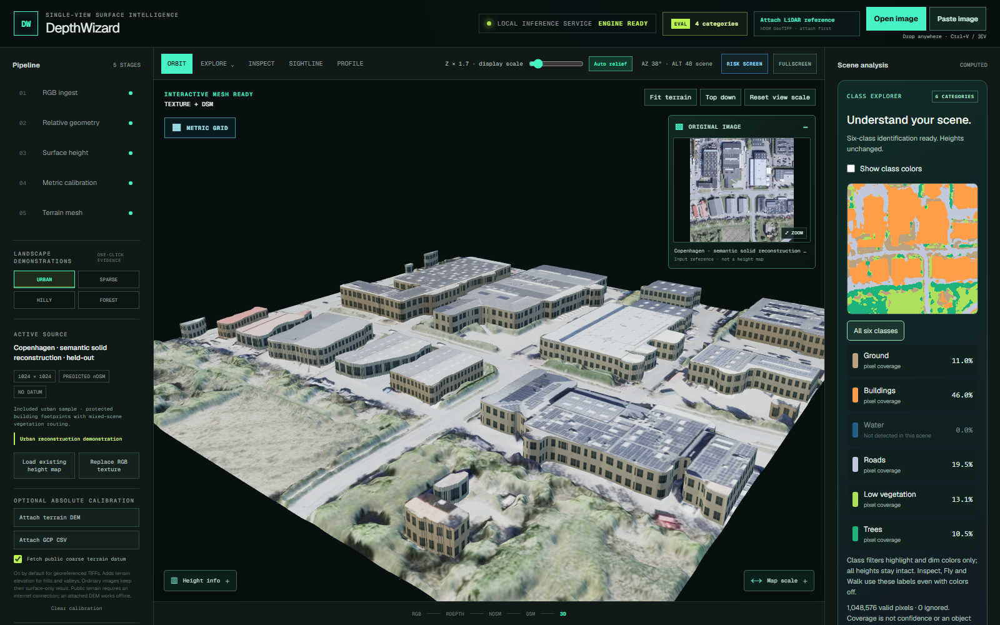
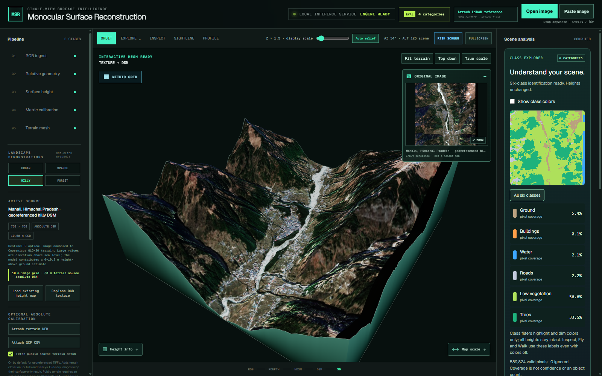
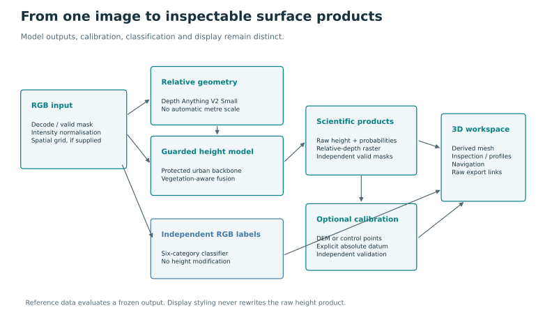

<div align="center">


# Monocular Surface Reconstruction

**One image. An inspectable surface.**

A research workspace for estimated height, geospatial terrain and six-category scene understanding.

[](https://github.com/GauravR17A/monocular-surface-reconstruction/actions/workflows/verify.yml)
[](https://github.com/GauravR17A/monocular-surface-reconstruction/releases/tag/v0.1.1)
[](docs/ROADMAP.md)

**[Read the handbook](docs/Monocular_Surface_Reconstruction_Technical_Documentation.pdf) · [Explore the evidence](docs/RESULTS.md) · [Run locally](#run-locally) · [Meet the team](#team-seifuku)**

Technical Documentation — Status as of **28 September 2026**

</div>



## A different way to read an overhead image

An image shows colour and texture. This workspace adds an estimated surface that
you can rotate, walk through, inspect and compare with a reference. A protected
height model, an independent RGB classifier and explicit geospatial calibration
keep each product's meaning visible throughout the workflow.

**This is an active research prototype.** Heights are estimates, and regional
classification weaknesses remain. The documentation records measured results,
failed experiments and ongoing work alongside the working application.

<table>
<tr>
<td width="50%"><a href="docs/assets/workspace.png"></a><br/><strong>Urban · structure and semantics</strong><br/>Explore the scene, inspect source values and distinguish class labels from height.</td>
<td width="50%"><a href="docs/assets/hilly-workspace.png"></a><br/><strong>Hilly · terrain in context</strong><br/>Read a georeferenced surface with its terrain datum and resolution made explicit.</td>
</tr>
</table>

*Screenshots from the verified application. Click either image for the full view.*

## Take a short tour

1. Choose **Urban**, **Sparse**, **Hilly** or **Forest** from the saved demonstrations.
2. Rotate the scene in **Orbit**, then try **Explore** to move through it.
3. Use **Inspect** to read source values; use **Profile** to sample a cross-section.
4. With the local API available, explore the six-class overlay or open a new RGB image.
5. Compare against an eligible independent reference and export the scientific products.

Saved surfaces work without model downloads. New-image inference and automatic
classification use the local Python API. [Full user guide](docs/USER_GUIDE.md).

## Inside the workspace

| Experience | What it does |
| --- | --- |
| **Reconstruct** | Turns supported overhead RGB imagery into estimated above-ground height and separate relative geometry. |
| **Calibrate** | Preserves georeferencing; accepts a terrain DEM or elevation control points for an appropriate absolute product. |
| **Identify** | Predicts ground, buildings, water, roads, low vegetation and trees independently of height. |
| **Explore** | Orbit, fly, walk, use the map and keep the original image in view. |
| **Inspect** | Query source values, examine class coverage and sample an elevation profile. |
| **Compare & export** | View aligned reference differences, scoped metrics and downloadable geospatial products. |

<details>
<summary><strong>See the system architecture</strong></summary>



The viewer uses React, TypeScript, Three.js and GeoTIFF.js through vinext's
implementation of the Next.js App Router. FastAPI connects the interface to
PyTorch inference, raster processing, calibration and result artifacts.
[Architecture](docs/ARCHITECTURE.md) · [Implementation map](docs/CODE_MAP.md).

</details>

## The research behind the interface

**204 pages · 87 bookmarked chapters · 63 dated development records**

The handbook explains how the system works and how it reached its current state:
the decisions, attempted improvements, retained baselines and unresolved questions.

| Start here | What you will find |
| --- | --- |
| [Technical handbook · PDF](docs/Monocular_Surface_Reconstruction_Technical_Documentation.pdf) | The complete dated document, including Team Seifuku and the historical research appendix. |
| [Methods and scientific contracts](docs/METHODS.md) | Model design, fusion, tiling, calibration, units and validity rules. |
| [Experiment register](docs/EXPERIMENTS.md) | What was tried, why it was tried, the outcome and the resulting decision. |
| [Decision register](docs/DECISIONS.md) | Alternatives and consequences, with supporting records. |
| [Results and limitations](docs/RESULTS.md) | Named models, comparable support, regional transfer and failure analysis. |
| [Documentation index](docs/README.md) | User guide, data provenance, model cards, API, setup, security and roadmap. |

### A few results, with their scope attached

| Model / support | Recorded result | Interpretation |
| --- | ---: | --- |
| Protected height · measured building pixels | **13.24 m RMSE** | Corrected full-scene development support. |
| Protected height · vegetation-only pixels | **8.36 m RMSE** | A different masked population; not a universal error bound. |
| Active RGB V3 · OEM equal-region development | **69.42% macro F1** | Some predeclared retention gates failed. |
| Older RGB V1 · Christchurch external test | **61.63% macro F1** | A separate completed transfer test; this is not a V3 result. |

The selected showcase scenes have narrower results of their own. They do not
replace the corrected benchmark. [Read the complete evidence](docs/RESULTS.md).

## Run locally

### Start with the saved scenes

Use Node.js 22.13 or later in the 22.x line and npm. From the repository root:

```powershell
npm --prefix viewer ci
npm --prefix viewer run build
npm --prefix viewer run start -- --hostname 127.0.0.1 --port 3000
```

Open **[127.0.0.1:3000](http://127.0.0.1:3000)** and choose a scene.

### Enable new-image inference

Use Python 3.10–3.12. The checked GPU host is Windows x64 with an NVIDIA RTX 4070
Laptop GPU. These commands install the documented CUDA build:

```powershell
python -m venv .venv
.venv/Scripts/python.exe -m pip install torch==2.7.0 torchvision==0.22.0 --index-url https://download.pytorch.org/whl/cu128
.venv/Scripts/python.exe -m pip install -r requirements.txt
.venv/Scripts/python.exe -m pip install -e . --no-deps
.venv/Scripts/python.exe scripts/download_models.py --include-foundation
.venv/Scripts/python.exe scripts/serve_api.py --device cuda
```

Keep the viewer running in a second terminal. The API defaults to
`127.0.0.1:8000`. The [setup guide](docs/SETUP.md) covers CPU installation, portable
commands and operating limits. Models are distributed separately from Git with
SHA-256 verification and **non-commercial research/evaluation restrictions**.

## Built to be checked

The released application source passed **826 Python tests** and **155 viewer
tests**, plus TypeScript, lint, production build and publication checks on a fresh
GitHub runner. **26 historical source/archive checks are explicitly skipped**;
they are not counted as passing. Actual browser checks also exercised packaged
models and generated results through an in-process transport.

[Hosted verification](https://github.com/GauravR17A/monocular-surface-reconstruction/actions/runs/36402191099) · [Evidence index](docs/evidence/README.md) · [Release scope](docs/RELEASE.md)

```powershell
.venv/Scripts/python.exe -m pip install -r requirements-dev.txt
.venv/Scripts/python.exe -m pytest tests -q
npm --prefix viewer run test
npm --prefix viewer run typecheck
npm --prefix viewer run build
.venv/Scripts/python.exe scripts/verify_publication.py
```

## Repository map

```text
src/msr/             Models, data, inference, calibration, evaluation and API
viewer/              Interactive workspace, saved scenes and frontend tests
scripts/ + configs/  Preparation, training, analysis and reproduction recipes
tests/               Numerical, model, raster, protocol and API checks
docs/                Handbook, evidence, figures and dated development records
model-artifacts.json Pinned model downloads, sizes and SHA-256 values
```

Full training archives and restricted source imagery are not bundled. Historical
protocols retain their original scientific scope; renamed public files are not
presented as untouched original experiment seals.

## Team Seifuku


| Member | Confirmed responsibility |
| --- | --- |
| Adwita Kurle | Team leader |
| Gaurav Ranade | Website creator and operator |
| Anushree Dixit | Team member |
| Spruha Kurle | Team member |
| Hrishikesh Tarade | Team member |
| Tanisha Natrajan | Team member |

Independent research project, **Pune, Maharashtra, India**.
Public contact: **ranadegaurav30@gmail.com**. [Team details](docs/TEAM.md).

Source datasets, model authors and software dependencies retain their credits and
terms. No blanket open-source licence has been selected for the original project
code. [Third-party notices and attribution](THIRD_PARTY_NOTICES.md).

---

<div align="center">

**Research continues. This is the documented state as of 28 September 2026.**

[Current roadmap](docs/ROADMAP.md) · [Release downloads](https://github.com/GauravR17A/monocular-surface-reconstruction/releases/tag/v0.1.1)

</div>
