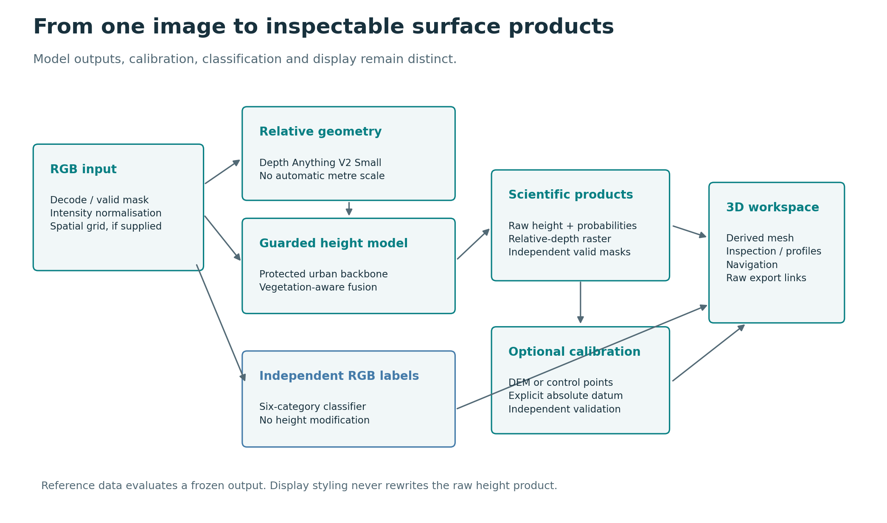

# Architecture and data lifecycle

## Component boundaries

| Component | Implementation | Responsibility |
| --- | --- | --- |
| Raster input | `src/msr/io/raster.py`, `data/radiometry.py` | Decode imagery, track validity, bound interactive resolution and preserve the spatial grid. |
| Relative prior | `inference/relative_depth.py` | Run Depth Anything V2 Small and produce scale-ambiguous geometry. |
| Height model | `models/height_net.py`, `models/domain_surface_net.py` | Estimate above-ground height through a multiscale decoder and guarded refinement. |
| Image inference | `inference/predict.py`, `inference/tiling.py` | Load models, normalize image tiles, blend overlapping predictions and preserve masks. |
| Calibration | `geospatial/calibration.py`, `geospatial/gcps.py` | Align terrain, fit control points and compose absolute products. |
| Independent identification | `models/rgb_segmenter.py`, `inference/rgb_preview.py` | Predict six RGB semantic categories and class coverage. |
| API | `api/app.py`, `api/classification.py` | Validate requests, serialize model access and publish job artifacts locally. |
| Presentation geometry | `inference/viewer_mesh.py`, viewer geometry helpers | Prepare a bounded display mesh and building solids separate from source measurements. |
| Browser | `viewer/app/terrain-workspace.tsx` and focused helper modules | Coordinate uploads, scenes, rendering, interaction, analysis and downloads. |
| Evaluation | `evaluation/` and evaluation scripts | Define fixed supports, compare models, report metrics and enforce promotion gates. |

Paths in the implementation column are relative to `src/msr/` unless a different
root is shown. The viewer follows the Next.js App Router component structure and
runs through vinext/Vite. Three.js owns the interactive scene; React coordinates
application state and controls. The public package uses a Node build without the
original host-specific preview bindings.

## Prediction lifecycle

An uploaded image receives a random job identifier. The API streams the upload to
its job directory, validates requested calibration/reference combinations and
invokes the runtime. The runtime lazily loads the height and foundation models and
uses a lock around GPU work. This limits simultaneous model execution within that
process; it is not a distributed queue or admission-control system.

The RGB reader selects supported bands, derives image validity and creates a
bounded processing grid when needed. Relative geometry is computed from the image.
The protected height model runs over overlapping normalized tiles. Its numerical
outputs are saved separately from the mesh representation. Calibration, if
requested, derives the appropriate additional product. Reference comparison uses
the declared prediction type and an independently supplied raster.

The API returns URLs for source-height, relative-depth, texture, probability,
presentation and validation products, plus structured metadata. The browser loads
these artifacts and constructs the scene. Once reconstruction completes, eligible
scenes can request the separate RGB classifier. The UI guards against stale class
maps during scene switches and caches a bounded number of successful maps in the
browser session.

## Independent semantic branch

The six-class model receives image data and image-validity support. It does not
receive reference heights, reference classes, calibration targets or the height
prediction as an input. It returns class IDs and coverage statistics. The final
class map may change an overlay or inspection label but does not mutate the height
raster, collision field or building-solid geometry.

The older three-group ground/building/vegetation mechanism remains part of height
fusion. It is not the same classifier as the visible six-category identification.
This separation is deliberate: the experiments did not establish that replacing
protected height behavior with semantic-guided corrections was consistently safe.

## Artifact lifecycle

Training runs retain configuration, source bindings, epochs, metrics and checkpoint
identities. Development comparison is distinct from final testing. Release
packaging extracts inference-only tensors and the configuration needed to restore
the model; optimizer/RNG payloads and machine-specific paths are omitted. Tensor
equality and output equivalence are checked separately from file-hash equality.

The public source package has its own identity and history. Renaming modules and
normalizing locators changes source bytes, so it cannot truthfully inherit every
historical cryptographic source seal. Historical reports remain evidence of those
earlier runs; new experiments need their own source/configuration bindings.

## Operational boundaries

The packaged service is intended for local use. The frontend defaults to an API on
the loopback interface. There is no user authentication, multi-tenant job isolation,
durable cloud storage or production GPU scheduler. A hosted version would require
a separate deployment design. Source publication is not a hosted inference service.
