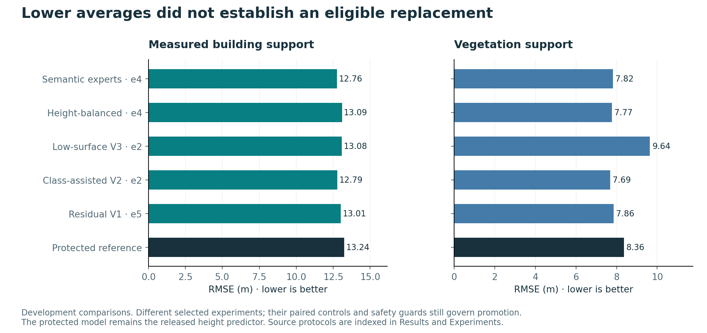

# Results and interpretation

All scores below are preserved research measurements with their stated protocols.
They are not newly rerun full-dataset evaluations for the source publication.
Release packaging checks are reported separately in [Release](RELEASE.md).

## Canonical corrected height baseline

The protected model was evaluated on 160 complete HighBuild scenes and 120
OpenCanopy scenes using matched inputs and valid reference support. These are
development results. HighBuild uses strict measured-height masks, not unknown
background filled with zero.

| Population | Support | RMSE (m) | MAE (m) | Correlation | R-squared |
| --- | --- | ---: | ---: | ---: | ---: |
| Pooled strict urban + forest | 31,011,260 pixels | 10.16 | 4.91 | 0.482 | 0.203 |
| Measured building pixels | 13,855,690 pixels | 13.24 | 5.36 | 0.186 | -0.066 |
| All valid forest-scene pixels | 17,155,570 pixels | 6.71 | 4.55 | 0.659 | 0.422 |
| Vegetation-only pixels | 7,852,823 pixels | 8.36 | 6.51 | 0.411 | -0.174 |
| Forest-ground pixels | 9,302,747 pixels | 4.89 | 2.90 | 0.502 | -0.088 |
| Matched measured buildings | 328 objects | 11.15 | 4.42 | 0.244 | 0.037 |

Pixel and object rows answer different questions. The object row uses one median
prediction per matched building and excludes unmatched references; it is not a
replacement for the all-eligible measured-building pixel score. A weak or negative
R-squared remains visible even when the mean error looks modest.

## Why later height candidates were not promoted

| Candidate / selected comparison | Building RMSE (m) | Canopy RMSE (m) | Decision |
| --- | ---: | ---: | --- |
| Protected reference | 13.2426 | 8.3610 | Retained |
| Residual V1, epoch 5 | 13.0121 | 7.8565 | Rejected: not all registered guards pass |
| Class-assisted fast V2, epoch 2 | 12.7883 | 7.6885 | Rejected: ground and short vegetation worsen |
| Low-surface V3, epoch 2 | 13.076 | 9.637 | Rejected: canopy loss offsets low-surface gains |
| Height-band-balanced, epoch 4 | 13.094 | 7.770 | Rejected: safety and comparison tradeoffs |
| Six-class semantic experts, epoch 4 | 12.7558 | 7.8238 | Rejected: no eligible paired-benefit/safety outcome |

These rows share the corrected development context but are different experiments
and checkpoints. They are not a ranking that replaces each run's predeclared
selector. The matched neutral control is essential: in the semantic-expert run,
control epoch 4 scores 12.7649 m buildings and 7.7913 m canopy. The class-guided
candidate is only 0.0091 m better for buildings and worse for canopy. One paired
run does not establish a reliable benefit from class guidance.

Tall structures dominate building error. In the residual-height analysis,
reference heights of at least 20 m account for 17.64% of measured building pixels
but 89.31% of baseline squared error. Reduced bias can improve RMSE without
improving centered error spread or shape agreement. Those diagnostics motivate
better supervision and context checks rather than unsupported accuracy claims.

## Classification results belong to named models

**The active RGB V3 classifier records 83.20% six-class macro F1 on GAMUS
development validation.** Macro F1 averages the six class F1 scores; this is a
classification benchmark with a named dataset and split. Regional transfer is
reported separately below. The earlier V1 model recorded 83.83% on its reused
DC/Philadelphia development validation.

| Model and evaluation | Six-class macro F1 | Scope |
| --- | ---: | --- |
| RGB V1, DC/Philadelphia development | 83.83% | Reused model-selection validation |
| RGB V1, Christchurch | 61.63% | One completed external test on 49 labelled pairs |
| RGB V1, 12-scene all-class OEM challenge | 54.02% | Label-enriched diagnostic selection |
| RGB V3 epoch 1, GAMUS | 83.20% | Development comparison; some retention regressions |
| RGB V3 epoch 1, OEM pooled | 73.29% | Pooled development confusion counts |
| RGB V3 epoch 1, OEM equal-region | 69.42% | Predeclared region-balanced selector |

The V3 package is the active app classifier because its integration was authorized
as product behavior. It is not certified by V1's external result and did not pass
all V3 model-safety gates. Epoch 4 had higher pooled OEM F1 (74.47%) but lower
equal-region F1 (68.56%); switching the selector afterward would misrepresent the
experiment.

Christchurch V1 per-class F1 is 24.78% ground, 72.57% buildings, 87.38% water,
62.27% roads, 53.77% low vegetation and 69.03% trees. Its macro IoU is 47.23%.
The tile-bootstrap macro-F1 interval of 58.43–63.83% is within-city descriptive
uncertainty; it does not account for all neighbouring-tile dependence or global
geographic variation. Road-boundary F1 is only 23.07% at the stated tolerance.

## Demonstration cases

| Case | Recorded RMSE / MAE | Interpretation |
| --- | --- | --- |
| Sparse Amsterdam | 1.48 / 0.71 m | One selected held-out scene under its reference contract |
| Urban US3D | 2.54 / 1.30 m | One selected 262,144-pixel RGB/LiDAR comparison |
| OpenCanopy forest | 4.22 / 2.86 m | One 147,456-pixel official-test chip |
| Manali terrain comparison | 15.03 / 10.24 m | Absolute product versus separately aligned coarse SRTM; datum/resolution effects remain |

These cases demonstrate supported workflows. They must not replace the broader
corrected benchmark, be averaged into a new overall score, or be presented as
randomly sampled independent final evidence. High terrain correlation can be
dominated by broad relief while meaningful local elevation errors remain.

## Inference-protocol sensitivity

On matched development support, app tiling changed building RMSE from 13.243 to
13.442 m and vegetation RMSE from 8.361 to 11.882 m relative to full-native
evaluation. A separate fixed-precision padding comparison reduced vegetation RMSE
to 8.366 m but worsened forest-ground RMSE from 4.297 to 4.885 m. It is therefore
incorrect to report the favourable padding number as a universal model upgrade.

## What is still unmeasured

The reserved Bay of Plenty metric-height scene has no final model score. Broad
cross-sensor transfer, calibrated correctness probabilities, precise individual
tree height, comprehensive building counting and independent expert validation
remain unestablished. Relative error reductions are not percentages of correct
predictions. The project is useful as a transparent research prototype while those
questions remain open.

US3D/DFC2019 raw imagery and reference rasters are excluded from this public
package because the source terms prohibit redistribution. The historical
selected-scene numerical result remains documented; its visual comparison is
unavailable in the public viewer. The Copenhagen urban reconstruction demo is
separate and remains available.
